# 在idea中如何打Jar包

今天我们讲讲在idea中如何打Jar包。
演示代码来自课程：[《Socket网络编程进阶与实战》](https://coding.imooc.com/class/286.html)

## 目的

首先我们需要说明打Jar包的主要目的：

1. 为了给其他库依赖引入代码使用
2. 为了能直接发布Jar包使用Java -jar 运行

## 准备

来看一下我们的项目目录结构：

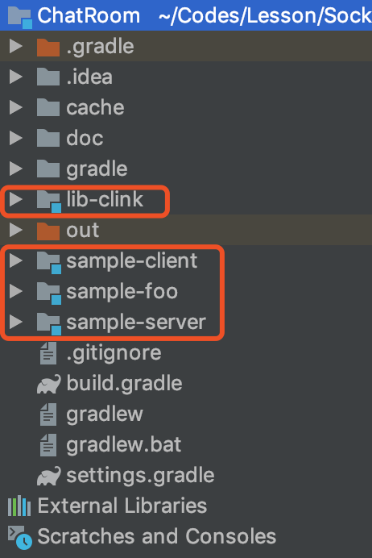

本项目是使用gradle构建的项目，当然这不是重点，我们关注的是项目中有4个module；这是我们今天的主角。

来看一下各自的依赖关系：

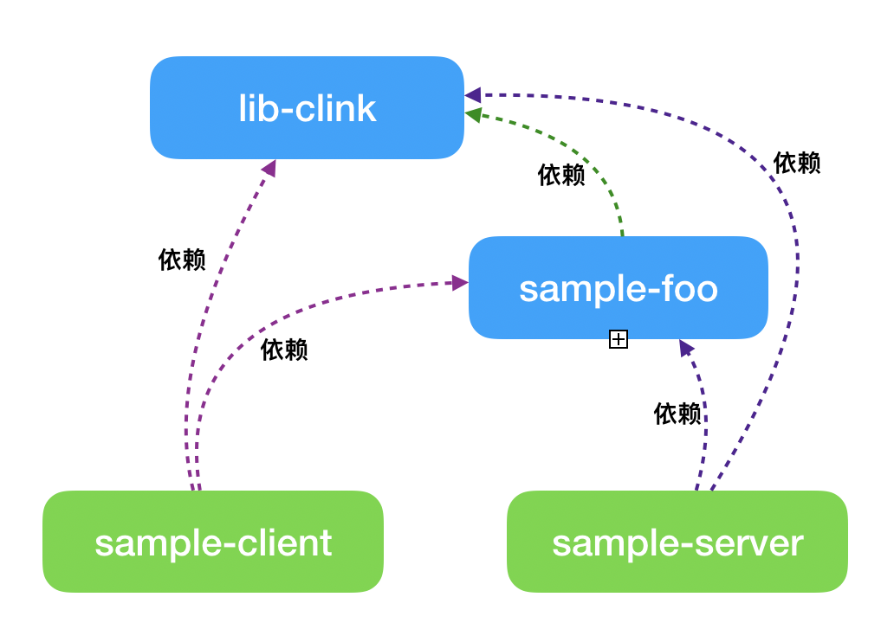

从图可以得出如下结论：

1. foo依赖了clink
2. client同时依赖了foo、clink
3. server同时依赖了foot、clink

同时通过不同的颜色，我想要给大家传达的是：

1. lib-clink是一个库
2. sample-foo是一个库
3. sample-client、sample-server是一个可运行的库

什么是可运行的库：简单来说就是库中含有可运行的入口：

```java
public static void main(String[] args){}
```

那么这样的组织架构在实际的开发中是非常常见的，clink作为基础的框架层面，foo中做一些两端都需要使用到的常见工具类封装，然后client、server是不同的终端module。

## 打包操作

实际的打包操作并不复杂，打包单纯的jar包比含有main函数的jar包更加简单一些。

### Case 1

我们先来打包一下最简单的clink包。

**步骤1：**clink module上右键选择：**“Open Module Settings”**

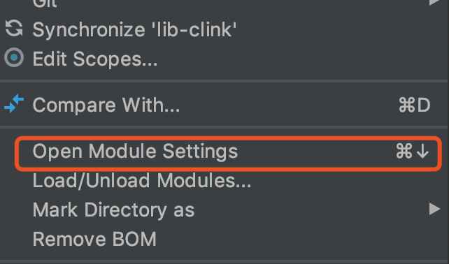

**步骤2：**选择**“Artifacts”**同时点击**“+”**

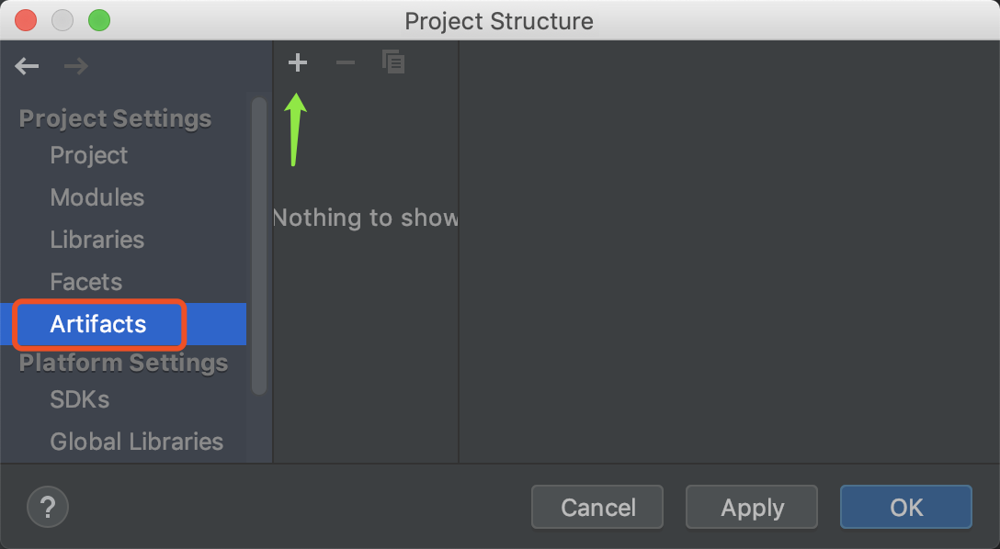

**步骤3：**弹出选项中选择从一个module创建Jar

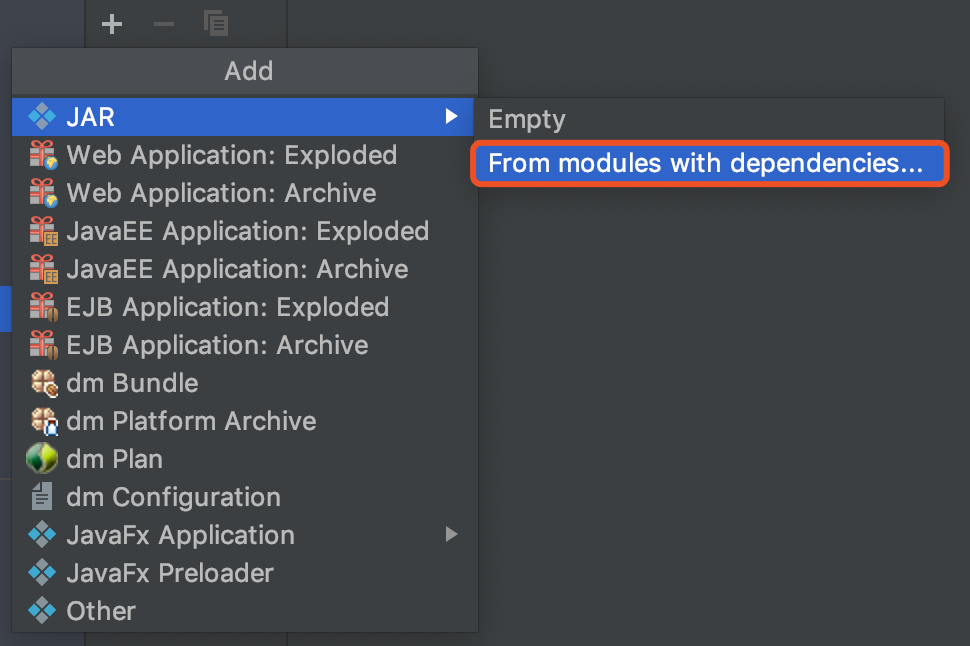

**步骤4：**选择对应的module库，此时有一些其他选项暂时不用管。

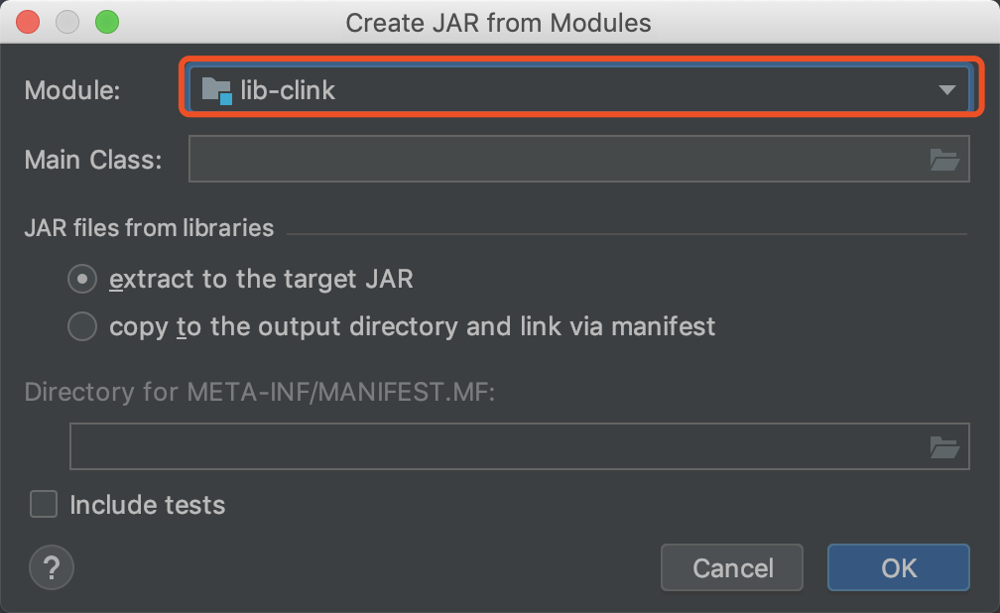

**步骤5：**此时核对如图所示的选项，点击OK即可。

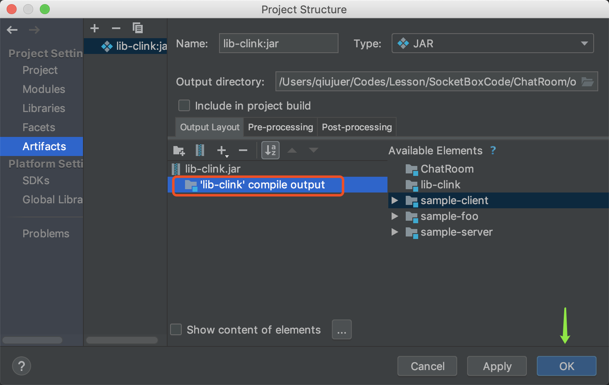

**步骤6：**选择Build菜单中的**“Build Artifacts”**

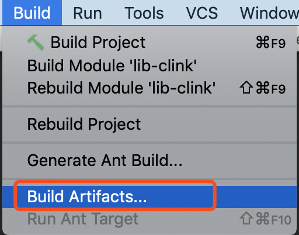

**步骤7：**在弹出选项中，选择build、rebuild都是可以；也可以选择清理或者再次编辑。

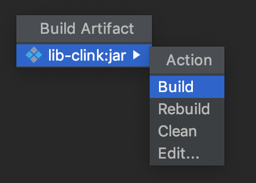

当你点击后，在项目的根目录out文件夹中将可以找到当前的Jar包。

**请注意：默认的是项目的根目录中找到Jar包；一般不用单独配置输出目录。**

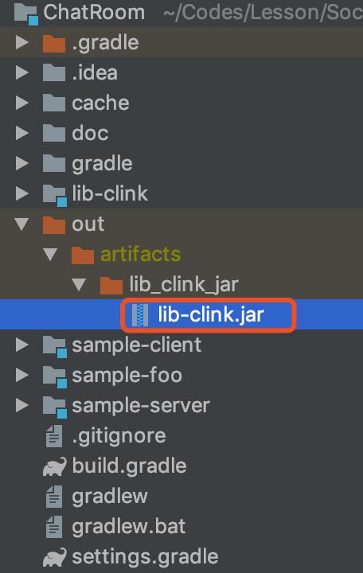

以上就是单纯的Jar打包流程，此时你可以把生成的jar给其他的项目依赖使用了。

### Case 2

以上说的是简单的Jar包打包流程，我们再来说说有Main函数的Jar打包流程。

这里我们选取：**“sample-server”**进行，前面阶段都是一样，直接到达**步骤4**。

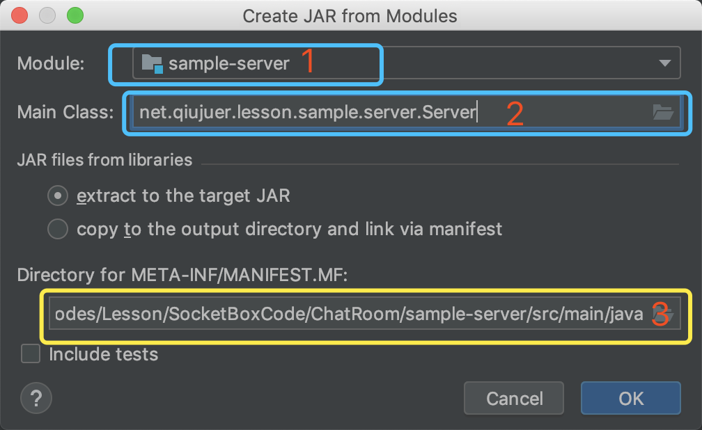

如图所示：

1. 选择我们的module
2. 选择我们的Main函数地址
3. 是根据Main函数自动生成的**"META-INF"**信息，无需更改

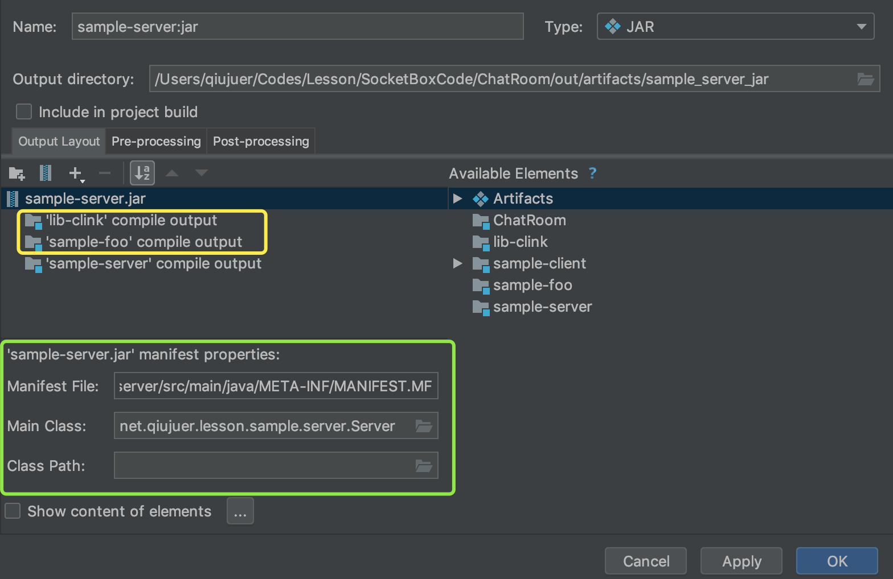

点击下一步后，我们可以看见生成的配置，此时可以看见黄色框中自动添加了**clink**以及**foo**的代码输出打包；这是因为server module依赖了上述两个module的原因。

同时绿色框中将有一些Manifest清单的描述信息，我们先点击OK，看一下项目代码。

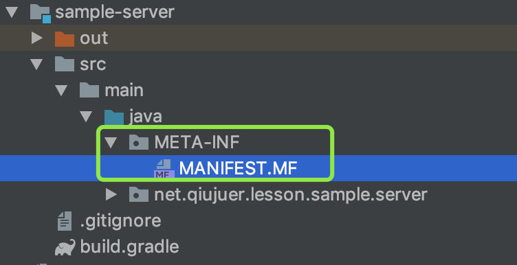

当我们打开项目代码后，可以在项目代码的根目录下看见新增了一个文件夹，其中包含了Manifest清单文件，打开MF文件，可以看见其中指定的Main-class配置信息。这是为了让我们直接运行该jar的时候能够顺利找到Main函数而准备的。

```css
Manifest-Version: 1.0
Main-Class: net.qiujuer.lesson.sample.server.Server
```

当然，此时你去进行**“Build Artifacts”**输出你会发现，你生成的Jar文件无法使用Java直接运行。

```css
$ java -jar sample-server.jar 
Error: Invalid or corrupt jarfile sample-server.jar
```

回到**步骤5**中，我们需要输出一下清单文件。默认的，idea虽然为我们自动生成了清单文件，但是并未在jar打包时输出它。

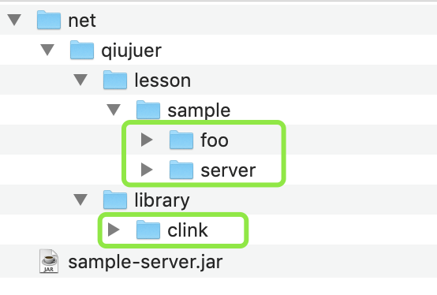

如图，解压jar后只会看见其中的clink、foo、server的相关代码，但没有清单文件，所以运行时无法顺利找到Main函数。

我们需要在配置上添加一个文件夹：**“META-INF”**

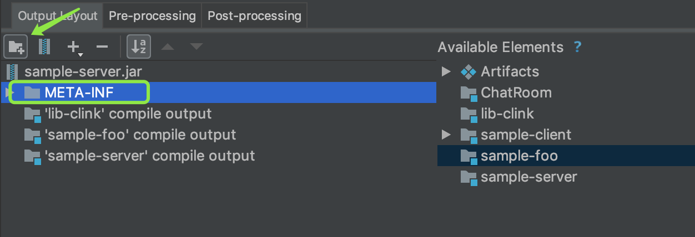

添加好文件夹后，我们选中文件夹，然后添加文件，可以右键，也可以点击上面的菜单。
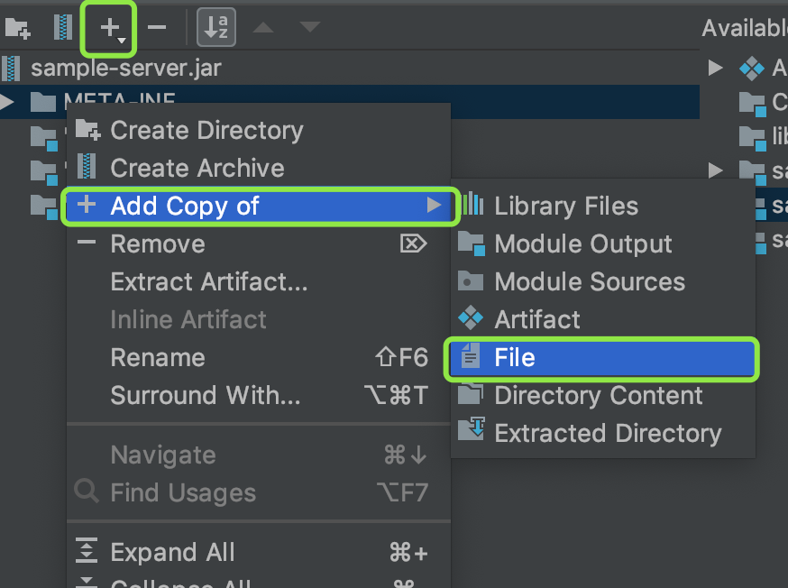

在弹出的选择框中，选中我们之前给大家看的清单文件，该文件idea已为我们在module的src目录下生成。

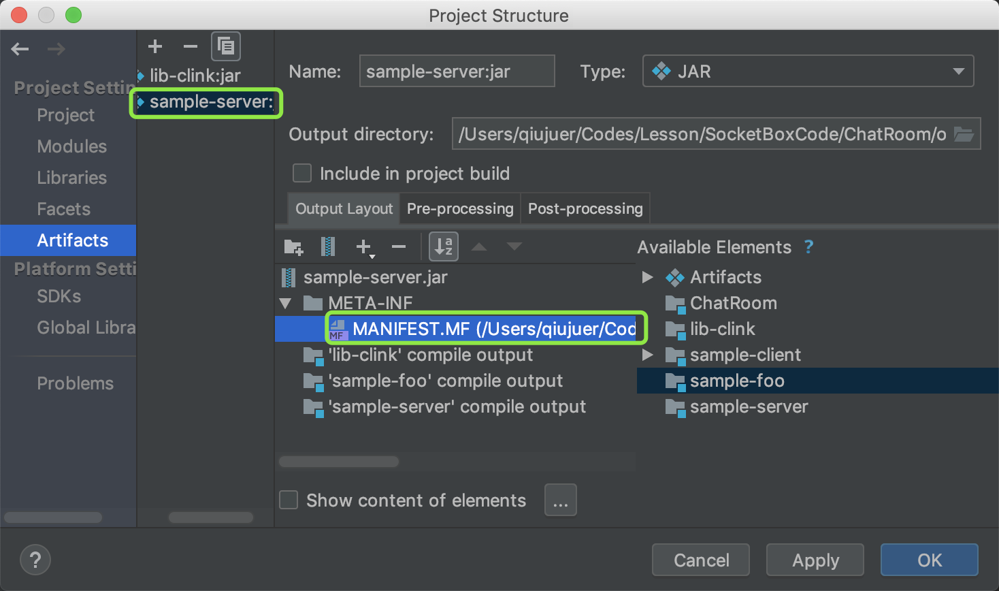

全部弄好后是这样的，然后点击OK，再次生成Jar即可。

再次进入文件夹后使用命令：**java -jar sample-server.jar** 可以顺利运行：

```css
$ java -jar sample-server.jar 
服务器准备就绪～
服务器信息：/0:0:0:0:0:0:0:0:30401
UDPProvider Started.

```

解压之后也可以在根目录下发现清单文件：
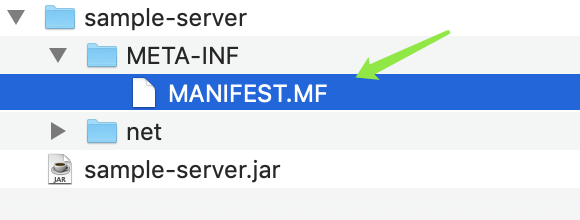

至此，已给大家说明了idea上如何打包jar的全部流程，可以发现流程虽多，但是流程还是比较傻瓜的。希望对大家有所帮助。

以上演示的代码来自于课程：[《Socket网络编程进阶与实战》](https://coding.imooc.com/class/286.html)

